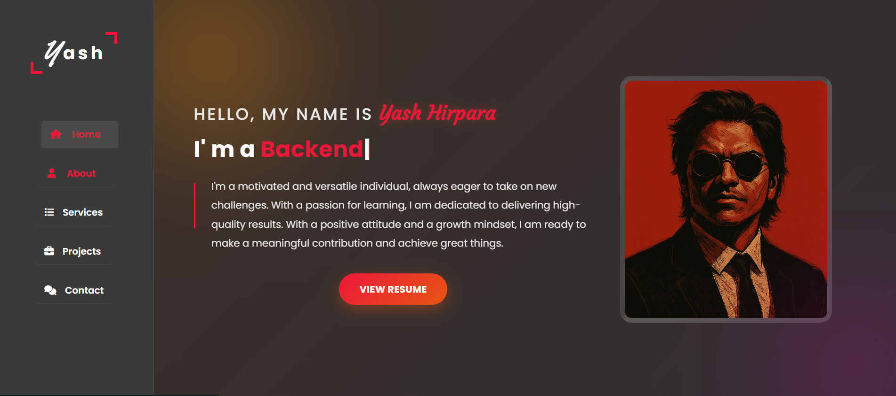

<!DOCTYPE html>
<html lang="en">
<head>
    <meta charset="UTF-8">
</head>
<body style="font-family: Arial, sans-serif; line-height: 1.6;">

<h1>Personal Portfolio Website</h1>

    A modern and fully responsive <strong>Portfolio Website</strong> built using 
    <strong>HTML, CSS, and JavaScript</strong>. This website showcases my 
    <strong>skills, projects, experience, services, and contact information</strong> 
    with a clean UI and smooth animations.

<h2>Homepage Preview</h2>

    Here is a snapshot of the homepage of my portfolio, featuring a modern sidebar navigation, animated typing text, 
    and a professional hero section.

<h2>Features</h2>
<ul>
    <li><strong>Responsive Design</strong> – Fully optimized for all devices.</li>
    <li><strong>Smooth Animations & Transitions</strong></li>
    <li><strong>Sidebar Navigation Menu</strong> with icons</li>
    <li><strong>Dynamic Typing Effect</strong> (I'm a Backend Developer…)</li>
    <li><strong>Projects Showcase Section</strong></li>
    <li><strong>Services Section</strong></li>
    <li><strong>About Me</strong> introduction</li>
    <li><strong>Contact Form / Contact Links</strong></li>
    <li><strong>Modern Dark Theme UI</strong></li>
</ul>

<h2>Tech Stack</h2>
<table border="1" cellpadding="8" cellspacing="0">
    <tr>
        <th>Technology</th>
        <th>Purpose</th>
    </tr>
    <tr>
        <td>HTML5</td>
        <td>Website structure</td>
    </tr>
    <tr>
        <td>CSS3</td>
        <td>Styling, layout, animations</td>
    </tr>
    <tr>
        <td>JavaScript</td>
        <td>Interactivity and dynamic UI effects</td>
    </tr>
    <tr>
        <td>Font Awesome / Icons</td>
        <td>Sidebar icons</td>
    </tr>
</table>

<h2>Project Structure</h2>

<pre style="background: #f4f4f4; padding: 10px; border-radius: 5px;">
portfolio-website/
│── index.html
│── style.css
│── script.js
│── assets/
│     ├── images/
│     ├── icons/
│     └── other media
│── README.html
</pre>

<h2>Contact</h2>

    <strong>Name:</strong> Yash Hirpara 
    <strong>LinkedIn:</strong> 
    <a href="https://www.linkedin.com/in/yashhirpara0306/" target="_blank">
        https://www.linkedin.com/in/yashhirpara0306/
    </a> 
    <strong>Email:</strong> 
    <a href="mailto:yashhirpara0306@gmail.com">
        yashhirpara0306@gmail.com
    </a>

<h2>Author</h2>

    <strong>Yash Hirpara</strong> 
    Backend Developer | Java | Spring Boot | API Development

</body>
</html>
